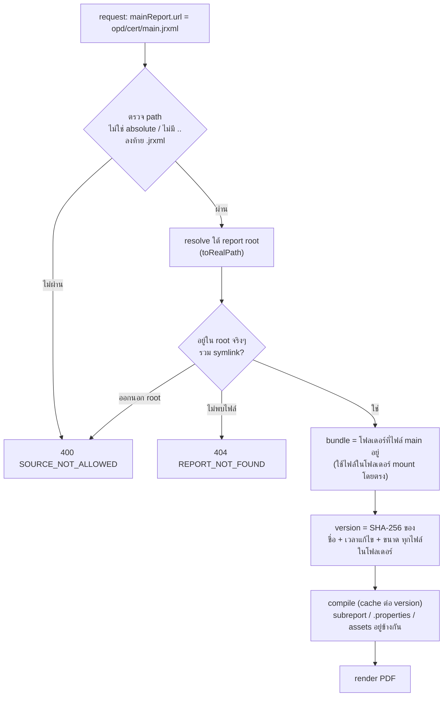
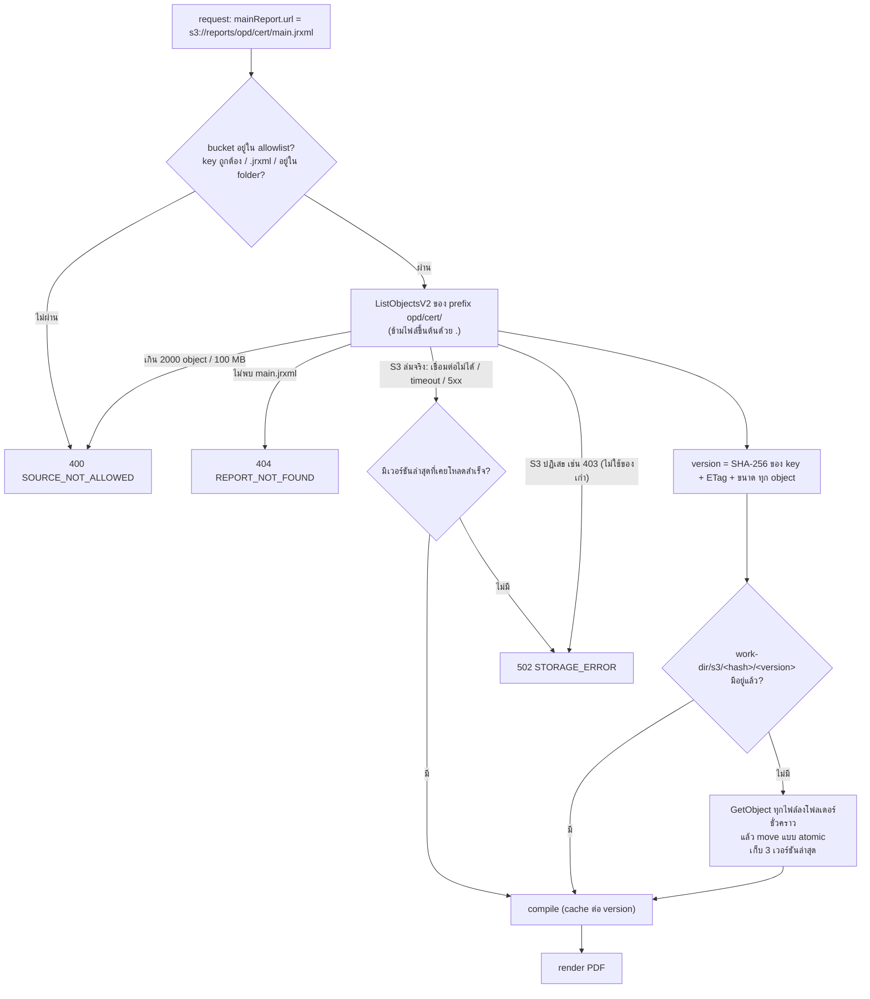
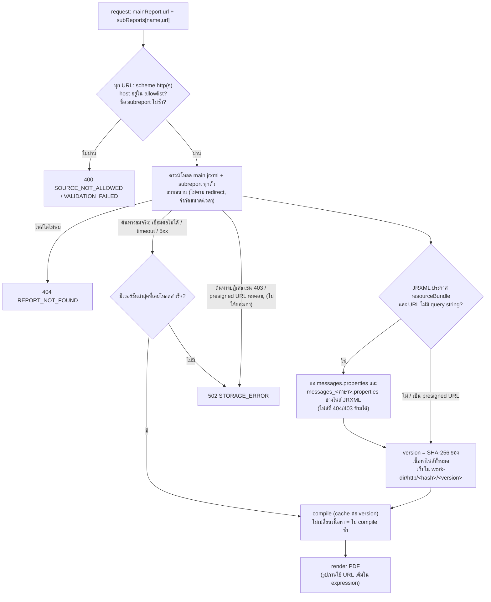
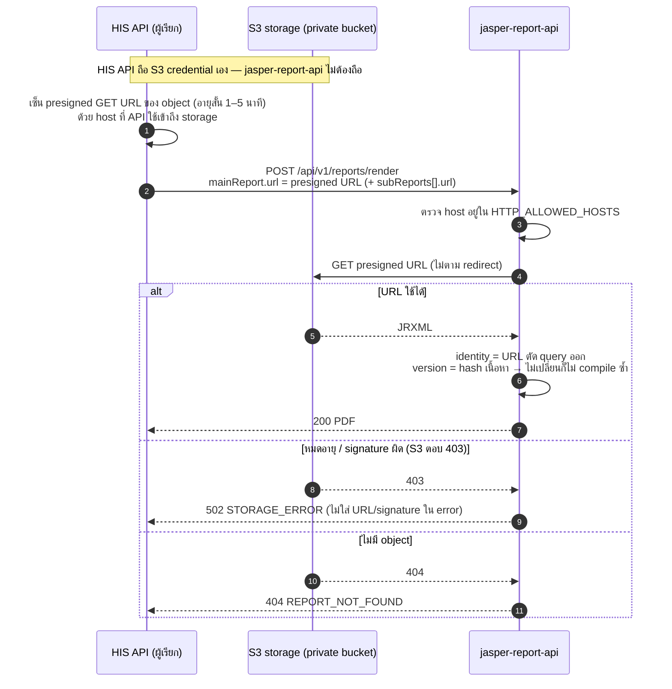

# jasper-report-api

REST API สำหรับสร้างรายงาน PDF จาก JasperReports (JRXML) — ต่อยอดจาก `jasperreports-pdf` และ `jasperreports-generater`

- รับ JRXML จาก **โฟลเดอร์ที่ mount ไว้** หรือ **S3-compatible storage** (rustfs, MinIO, AWS S3) หรือ URL ของ host ที่อนุญาตไว้
- **การเชื่อมต่อ DB อยู่ที่ API** — client ส่งแค่ชื่อ datasource (`opd`, `ipd`, ...) ไม่ส่ง JDBC URL/รหัสผ่าน
- รองรับ **ฟอนต์ไทย** (TH Sarabun New ฝังใน PDF), **barcode** (Code128, Code39, EAN, PDF417, ...) และ **QR code** (รวมข้อความภาษาไทย)
- JasperReports **7.0.8**, Java 21, Spring Boot 4.1
- API key, จำกัดจำนวน render พร้อมกัน/เวลา/จำนวนหน้า, metrics (Prometheus), health/readiness, JSON error แบบ RFC 9457
- รูปแบบ request เข้ากันได้กับ `jasperreports-pdf` (`POST /api/v1/jasper/generate` ยังใช้ได้)

เอกสารออกแบบและเหตุผลของแต่ละข้อตัดสินใจ: [docs/design/jasper-report-api-design.md](docs/design/jasper-report-api-design.md)

> **ข้อสำคัญ:** JasperReports 7.0.8 **อ่าน JRXML รูปแบบของ 6.x ไม่ได้** (ทดสอบแล้วกับไฟล์จริง) ต้องเปิดแล้วบันทึกใหม่ด้วย Jaspersoft Studio 7 ก่อน — ดู [การเขียน/แปลง JRXML](#การเขียนและแปลง-jrxml)

---

## เริ่มใช้งานเร็ว (demo ในคำสั่งเดียว)

ต้องมี Docker (compose v2)

```bash
make dev-up
```

คำสั่งนี้จะ: สร้าง `.env` พร้อม API key สำหรับ demo → เริ่ม API + PostgreSQL (มีข้อมูลตัวอย่าง) + rustfs → อัปโหลดรายงานตัวอย่างจาก `samples/reports/` ไปที่ rustfs → พิมพ์คำสั่ง `curl` ที่ใช้ได้ทันที (key เก็บไว้ที่ `.dev-api-key`)

```bash
curl -X POST http://127.0.0.1:8080/api/v1/reports/render \
  -H "X-API-Key: $(cat .dev-api-key)" -H "Content-Type: application/json" \
  -d '{"mainReport":{"url":"s3://reports/samples/demo/demo.jrxml"},"parameters":[{"name":"hn","value":"HN001"}]}' \
  -o demo.pdf
```

รายงานเดียวกันจากโฟลเดอร์ที่ mount: `"url":"demo/demo.jrxml"` — เลิกใช้ด้วย `make dev-down` (ลบ volume ของ demo ด้วย)

---

## การติดตั้งใช้งานจริง

### 1. เตรียม API key

```bash
make api-key CLIENT=hosos-web
```

ได้ key (`jra_...`) กับค่า SHA-256 — **ส่ง key ให้ client ครั้งเดียว** (ฝั่ง API เก็บแค่ hash กู้คืน key ไม่ได้) แล้วนำ hash ไปใส่ใน `.env` ตามที่สคริปต์พิมพ์ให้ (ดู [API key](#api-key))

### 2. ตั้งค่า `.env`

```bash
cp .env.example .env
```

อย่างน้อยต้องมี: `REPORT_SECURITY_API_KEYS_0_*` (จากข้อ 1), `OPD_DB_URL/USER/PASSWORD` และ `REPORTS_DIR` (โฟลเดอร์บน host ที่เก็บ JRXML) — ตัวแปรทั้งหมดอยู่ใน [การตั้งค่า](#การตั้งค่า) ใช้ **DB user แบบ read-only**

### 3. เริ่มระบบ

```bash
docker compose up -d --build        # หรือ make up
curl http://127.0.0.1:8080/api/healthz
```

- port เริ่มต้น bind ที่ `127.0.0.1:8080` (เปลี่ยนด้วย `API_BIND`, `API_PORT`) — เปิดให้ host อื่นเรียกเฉพาะเมื่อมี firewall/reverse proxy คุม
- ไม่ต้อง build jar นอก Docker (Dockerfile build เองแบบ multi-stage)
- โฟลเดอร์ JRXML mount แบบ **read-only** ที่ `/app/reports`; แก้ไฟล์บน host แล้ว request ถัดไปใช้ไฟล์ใหม่ทันที โดยไม่ต้อง restart

---

## การเรียกใช้

Base path คือ `/api`

| Method | Path | หน้าที่ | ต้องใช้ API key |
|---|---|---|---|
| POST | `/api/v1/reports/render` | สร้าง PDF (หรือ `xlsx` / `csv` ด้วย `format`) | ใช่ |
| POST | `/api/v1/jasper/generate` | เหมือน `render` (alias ให้ client ของ `jasperreports-pdf`) | ใช่ |
| POST | `/api/v1/reports/convert` | แปลง JRXML ของ JasperReports 6.x เป็นรูปแบบ 7 พร้อมรายการสิ่งที่ต้องตรวจ ดู [แปลง JRXML 6.x → 7](#แปลง-jrxml-6x--7) | ใช่ |
| POST | `/api/v1/reports/validate` | compile รายงานแล้วบอกว่า API เห็นอะไร (parameter, datasource, ฟอนต์, คำเตือน) โดยไม่รัน query | ใช่ |
| GET | `/api/v1/openapi.yaml` | สัญญา API แบบ OpenAPI 3.1 (ใช้ generate client หรือเปิดใน Swagger UI/Postman) ดู [OpenAPI](#openapi) | ไม่ |
| GET | `/api/healthz` | liveness แบบเดิม | ไม่ |
| GET | `/api/actuator/health/liveness`, `/readiness` | ตรวจสุขภาพ (readiness ตรวจ DB ทุกตัวและ S3) | ไม่ |
| GET | `/api/actuator/prometheus` | metrics | ใช่ (`X-API-Key` หรือ `Authorization: Bearer <key>`) |

### Request

```json
{
  "tenant": "hospital-a",
  "datasource": "opd",
  "mainReport": { "name": "ใบรับรองแพทย์", "url": "s3://reports/opd/medical_certificate/main.jrxml" },
  "subReports": [],
  "parameters": [
    { "name": "visit_id", "value": "1234" },
    { "name": "print_time", "value": "2026-10-06T10:30:00+07:00" },
    { "name": "item_ids", "value": [1, 2, 3] }
  ],
  "format": "pdf",
  "fileName": "ใบรับรองแพทย์",
  "locale": "en"
}
```

| ฟิลด์ | บังคับ | ความหมาย |
|---|---|---|
| `mainReport.url` | ใช่ | JRXML ที่จะใช้ ดู [แหล่งที่มาของ JRXML](#แหล่งที่มาของ-jrxml) |
| `mainReport.name` | ไม่ | ใช้ตั้งชื่อไฟล์ผลลัพธ์ถ้าไม่ส่ง `fileName` (ไม่ส่ง = ชื่อไฟล์ JRXML) |
| `mainReport.modified_at` | ไม่ | รับไว้เพื่อให้เข้ากับ `jasperreports-pdf` แต่ **ไม่ใช้** (API ดูการเปลี่ยนแปลงของไฟล์เอง) |
| `datasource` | ไม่ | ชื่อ datasource เชิงตรรกะ ดู [การเลือก datasource](#การเลือก-datasource) |
| `data` | ไม่ | JSON ที่รายงานแบบ `<query language="json">` อ่านแทนฐานข้อมูล ดู [รายงานแบบไม่ใช้ฐานข้อมูล](#รายงานแบบไม่ใช้ฐานข้อมูล-none-และ-json) — ส่งคู่กับ `datasource` ไม่ได้ |
| `tenant` | ไม่ | ไม่ส่ง = `default`; header `X-Tenant-Id` ชนะค่าใน body |
| `subReports[]` | ไม่ | `{"name": "sub_x", "url": "..."}` — **รายงาน http(s) ต้องระบุ subreport ทุกตัวที่ใช้** (ดาวน์โหลดมาเก็บเป็น `sub_x.jrxml` ในชุดเดียวกับรายงานหลัก) ส่วนโฟลเดอร์/S3 ไม่ต้องส่ง (มีอยู่ในโฟลเดอร์แล้ว) ยกเว้นแบบ `SUBREPORT_DIR` ที่ใช้เลือก subreport ที่จะ compile (ไม่ระบุ = ทุก `*.jrxml` ในโฟลเดอร์) |
| `parameters[].name` / `value` | ใช่ | ค่า parameter ดู [ชนิดของ parameter](#ชนิดของ-parameter) |
| `parameters[].type` | ไม่ | ใช้เฉพาะเมื่อ JRXML ประกาศชนิดกว้างๆ (`Object`, `Collection`) |
| `format` | ไม่ | `pdf` (ค่าเริ่มต้น), `xlsx` หรือ `csv` (ไม่สนตัวพิมพ์เล็ก/ใหญ่) ดู [รูปแบบไฟล์ผลลัพธ์](#รูปแบบไฟล์ผลลัพธ์-pdf--xlsx--csv) |
| `fileName` | ไม่ | ชื่อไฟล์ใน `Content-Disposition` (ภาษาไทยได้) ถ้ายังไม่มีนามสกุลของ `format` จะต่อให้ |
| `locale` | ไม่ | ภาษาของรายงาน เช่น `th`, `en`, `en-US` — **ชนะค่าที่รายงานกำหนดไว้เอง** ดู [หลายภาษา](#หลายภาษา-i18n) |

Header: `X-API-Key` (ตามโหมด [API key](#api-key)), `X-Tenant-Id` (ไม่บังคับ), `X-Request-Id` (ไม่บังคับ; ไม่ส่งจะสร้างให้ และส่งกลับ + อยู่ใน log ทุกบรรทัดของ request)

### Response

- สำเร็จ `200`, `Content-Type` ตาม `format` (`application/pdf`, `application/vnd.openxmlformats-officedocument.spreadsheetml.sheet` หรือ `text/csv; charset=UTF-8`), `Content-Disposition: inline; filename*=UTF-8''...` (PDF เปิดในเบราว์เซอร์; `xlsx`/`csv` เป็น `attachment`), `X-Report-Version` (เวอร์ชันของโฟลเดอร์รายงานที่ใช้จริง), `Content-Language` (ภาษาที่ใช้จริง เช่น `th`), `X-Request-Id`
- ผิดพลาด `application/problem+json`:

```json
{ "type": "about:blank", "title": "Bad Request", "status": 400, "code": "DATASOURCE_UNKNOWN",
  "detail": "datasource 'opdx' is not configured for tenant 'default'", "requestId": "..." }
```

| `code` | HTTP | เมื่อไร |
|---|---|---|
| `API_KEY_MISSING` / `API_KEY_INVALID` | 401 | ไม่ส่ง key (โหมด `required`) / key ไม่รู้จัก ปิดอยู่ หรือหมดอายุ |
| `VALIDATION_FAILED` | 400 | body ผิดรูปแบบหรือไม่ครบ |
| `TENANT_UNKNOWN`, `DATASOURCE_UNKNOWN` | 400 | ชื่อไม่มีใน config |
| `DATASOURCE_UNRESOLVED` | 400 | ไม่มี datasource ทั้งใน request, JRXML และค่า default |
| `DATASOURCE_OVERRIDE_DENIED` | 400 | request ไม่ตรงกับ JRXML และปิด override ไว้ |
| `DATASOURCE_NONE_NOT_ALLOWED` | 400 | ใช้ `datasource: "none"` กับรายงานที่มี `<query>` |
| `DATA_AND_DATASOURCE` | 400 | ส่งทั้ง `data` และ `datasource` |
| `DATA_NOT_SUPPORTED` | 400 | ส่ง `data` แต่รายงานไม่มี `<query language="json">` |
| `DATA_TOO_LARGE` | 413 | `data` เกิน `report.limits.max-data-size` |
| `SOURCE_NOT_ALLOWED` | 400 | path/bucket/host/scheme ไม่ได้รับอนุญาต หรือพยายามออกนอกโฟลเดอร์ |
| `PARAMETER_INVALID` | 400 | แปลงค่า parameter ไม่ได้ (ระบุชื่อ parameter) |
| `FORMAT_UNSUPPORTED` | 400 | `format` ที่ไม่ใช่ `pdf`, `xlsx`, `csv` |
| `LOCALE_INVALID` | 400 (ใน request) / 422 (ใน JRXML) | `locale` ไม่ใช่ language tag เช่น `th`, `en-US` |
| `REPORT_NOT_FOUND` | 404 | หาไฟล์/bucket ไม่เจอ |
| `REPORT_COMPILE_FAILED` | 422 | JRXML compile ไม่ผ่าน (รวมถึงเป็นรูปแบบ 6.x) |
| `PAGE_LIMIT_EXCEEDED` | 422 | เกิน `report.limits.max-pages` |
| `RENDER_BUSY` | 503 + `Retry-After` | ช่อง render เต็มนานเกิน `queue-wait` |
| `RENDER_TIMEOUT` | 504 | fill นานเกิน `fill-timeout` |
| `QUERY_TIMEOUT` | 504 | query ใน DB นานเกิน `query-timeout` |
| `DATABASE_ERROR` | 502 | DB ต่อไม่ได้หรือ SQL ผิด |
| `STORAGE_ERROR` | 502 | อ่าน S3/host ปลายทางไม่ได้ |
| `CONVERT_FAILED` | 400 | `/convert`: ไม่ใช่ XML, มี DOCTYPE/entity ภายนอก หรือซ้อนลึกเกินไป |
| `JRXML_TOO_LARGE` | 413 | `/convert`: `jrxml` ใหญ่เกิน `report.sources.max-bytes` |
| `DATASOURCE_MISCONFIGURED` | 500 | datasource ที่เรียกใช้ตั้งค่าไม่ครบ (เช่นไม่มี `url`) |
| `INTERNAL_ERROR` | 500 | อื่นๆ (เช่น รูปที่รายงานอ้างไม่มีไฟล์) |

### ชนิดของ parameter

ชนิดปลายทางคือ `class` ที่ **ประกาศใน JRXML** ค่าจาก JSON เป็น string/ตัวเลข/boolean/array ได้ ตัวอย่างที่ส่ง `type` ไม่ต้องแล้ว

| class ใน JRXML | ค่าที่รับ |
|---|---|
| `String` | ค่าอะไรก็ได้ (แปลงเป็น string) |
| `Integer`, `Long`, `Short`, `Byte`, `Double`, `Float`, `BigDecimal`, `BigInteger` | ตัวเลข หรือ string ตัวเลข |
| `Boolean` | `true`/`false`/`1`/`0` |
| `java.sql.Date`, `java.util.Date` | `yyyy-MM-dd` (`java.util.Date` รับ timestamp ได้ด้วย) |
| `java.sql.Time` | `HH:mm[:ss]` (ตามเขตเวลาของรายงาน) หรือมี offset: `10:30:00Z`, `10:30:00+07:00` |
| `java.sql.Timestamp` | ISO-8601: `2026-10-06T10:30:00+07:00`, `...Z` (= UTC), `2026-10-06T10:30:00` หรือ `2026-10-06 10:30:00` (ตามเขตเวลาของรายงาน) |
| `Collection`/`List`/`Set` | JSON array หรือ string คั่นด้วย `,`; ชนิดสมาชิกจาก `nestedType` ใน JRXML หรือ `type: "array_int"`/`"array_str"` |
| `Object` | ใช้ `type` (`string, integer, number, date, time, timestamp, bool, array_str, array_int`) ถ้าไม่ส่งจะได้ค่าตามที่ส่ง |

- parameter ที่ **ไม่ได้ประกาศใน JRXML** ถูกตัดทิ้ง (เตือนใน log; ตั้ง `report.parameters.strict=true` ให้ตอบ 400 แทน)
- `SUBREPORTS`, `SUBREPORT_DIR`, `IMAGE_DIR`, `REPORT_ASSETS_DIR`, `REPORT_LANGUAGE`, `REPORT_LOCALE`, `REPORT_CONNECTION`, `REPORT_TIME_ZONE`, ... เป็นของ API — ค่าที่ client ส่งมาถูกตัดทิ้ง
- ค่าที่แปลงไม่ได้ → `400 PARAMETER_INVALID` ระบุชื่อ parameter (ไม่ส่งค่า `null` เงียบๆ แบบเดิม)
- API ตั้ง time zone ของ JVM เป็น `report.timezone` (`Asia/Bangkok`) เพื่อไม่ให้ผลขึ้นกับเครื่อง/container และตั้ง `REPORT_LOCALE` ให้ทุกรายงานตามที่เลือกไว้ใน [หลายภาษา](#หลายภาษา-i18n)

### รูปแบบไฟล์ผลลัพธ์ (pdf / xlsx / csv)

| `format` | `Content-Type` | หมายเหตุ |
|---|---|---|
| `pdf` (ค่าเริ่มต้น) | `application/pdf` | เปิดในเบราว์เซอร์ (`inline`) ฝังฟอนต์ไทย |
| `xlsx` | `application/vnd.openxmlformats-officedocument.spreadsheetml.sheet` | ดาวน์โหลด (`attachment`) ข้อความเป็นเซลล์จริง (ตรวจชนิดข้อมูลให้) ทั้งรายงานอยู่ในชีตเดียวต่อเนื่อง ไม่ตัดตามหน้า |
| `csv` | `text/csv; charset=UTF-8` | ดาวน์โหลด คั่นด้วย `,` จบบรรทัดด้วย `CRLF` ขึ้นต้นด้วย UTF-8 BOM เพื่อให้ Excel อ่านภาษาไทยได้ (ปิดด้วย `report.export.csv-bom: false`) |

- ใช้ JRXML ไฟล์เดียวกับ PDF และ query เดียวกัน — ตัวส่งออกแปลงสิ่งที่ fill ได้ (`JasperPrint`) เป็นไฟล์ จึง**จัดวางตามหน้ากระดาษของรายงาน** รายงานที่ตั้งใจให้เป็นตารางข้อมูลควรออกแบบให้ field เรียงเป็นคอลัมน์ ไม่ซ้อนทับกัน และตั้ง `ignorePagination="true"` ใน `<jasperReport>` เพื่อไม่ให้ page header/footer แทรกกลางชีต
- แต่ละ element ยังอยู่ใต้กฎเดิม: `max-pages`, `fill-timeout`, ช่อง render และ virtualizer ใช้กับทุก format; รูป/QR/barcode ใส่ลง xlsx เป็นรูป ส่วน csv มีเฉพาะข้อความ
- metric `report_render_seconds` มี tag `format` ให้แยกดูได้
- `.xls` (Excel เก่า), `docx`, `html` ยังไม่รองรับ (ได้ `400 FORMAT_UNSUPPORTED`)

### รายงานขนาดใหญ่ (virtualizer)

ระหว่าง fill รายงานที่มีหลายร้อยหน้า JasperReports เก็บหน้าไว้ใน heap ทั้งหมดจน fill เสร็จ API จึงให้ทุก render ใช้ **swap-file virtualizer**: เก็บหน้าล่าสุดไว้ใน memory แค่ `report.virtualizer.max-pages-in-memory` หน้า (ค่าเริ่มต้น 100) ที่เหลือเขียนลงไฟล์ชั่วคราวแล้วอ่านกลับตอน export รายงานที่ไม่ถึงเกณฑ์นี้ไม่ถูกเขียนลงดิสก์เลย (สร้างไฟล์เปล่าไว้เท่านั้น)

- ไฟล์อยู่ที่ `report.virtualizer.directory` (ค่าเริ่มต้น `<report.cache.work-dir>/swap`) ต้องเขียนได้ — ใน container คือโฟลเดอร์ใน volume `report-cache` เหมือน cache อื่น
- ไฟล์ถูกลบเมื่อ render จบ ไม่ว่าสำเร็จหรือล้มเหลว (timeout, เกิน `max-pages` ฯลฯ) ไฟล์ที่ค้างจาก process ที่ล้มกลางคัน (`swap_*` เก่ากว่า 1 ชั่วโมง) ถูกลบตอนเริ่มระบบ
- ถ้าสร้างไฟล์ไม่ได้ (โฟลเดอร์เขียนไม่ได้) API log WARN แล้ว render ต่อโดยไม่ใช้ virtualizer แทนที่จะล้ม
- ปิดได้ด้วย `report.virtualizer.enabled: false`
- virtualizer ลดการใช้ heap ระหว่าง **fill** เท่านั้น ผลลัพธ์สุดท้ายยังถูกประกอบใน memory ก่อนตอบ (sync) จึงยังควรจำกัดด้วย `max-pages`

### OpenAPI

สัญญาของ API อยู่ที่ [src/main/resources/openapi/openapi.yaml](src/main/resources/openapi/openapi.yaml) (OpenAPI 3.1) และเปิดจาก API เองได้ที่ `GET /api/v1/openapi.yaml` โดยไม่ต้องมี API key — ครอบคลุม request/response ของทุก endpoint, รูปแบบ error (`application/problem+json`) พร้อมรายการ `code` ทั้งหมด, และ response ทั้งสามชนิดของ `render`

```bash
curl -s http://127.0.0.1:8080/api/v1/openapi.yaml -o openapi.yaml
npx @openapitools/openapi-generator-cli generate -i openapi.yaml -g typescript-fetch -o client/   # ตัวอย่าง: generate client
```

ไฟล์นี้เขียนด้วยมือ (ไม่ generate จาก annotation) เพื่ออธิบายสิ่งที่ annotation บอกไม่ได้ เช่น `code` ของ error และ media type ของแต่ละ format — เทสต์ `OpenApiContractTest` จึงตรวจให้ตรงกับโค้ดเสมอ: route ทุกตัวต้องมีในสัญญาและกลับกัน, ฟิลด์ของ request ตรงกับ `RenderRequest`, `format` ตรงกับ `OutputFormat`, และรายการ `ErrorCode` ตรงกับ code ที่โค้ดโยนได้ ถ้าแก้ API ต้องแก้ไฟล์นี้ด้วยไม่เช่นนั้นเทสต์ล้ม

### `POST /api/v1/reports/validate`

ใช้ body เดียวกับ `render` (ไม่ต้องมี `parameters`) ตอบ JSON เช่น

```json
{ "report": "demo.jrxml", "bundle": "s3://reports/samples/demo/", "version": "71e9fff3477ebf58", "tenant": "default",
  "datasource": { "declaredInReport": "opd", "requested": null, "resolved": "opd" },
  "parameters": [ { "name": "hn", "class": "java.lang.String", "hasDefault": false } ],
  "locale": { "declaredInReport": "th", "requested": null, "resolved": "th" },
  "messages": { "demo.jrxml": { "bundle": "messages", "languages": ["(base)", "en"], "keysUsed": 3 } },
  "fonts": { "used": ["TH Sarabun New"], "missing": [] },
  "subreports": ["sub_info.jrxml"],
  "warnings": [] }
```

`warnings` เตือนเมื่อ `$R{key}` ขาดในภาษาใดภาษาหนึ่ง, query ใช้ `$P!{...}` (ต่อค่าเข้า SQL ตรงๆ เสี่ยง SQL injection), ใช้ฟอนต์ที่ไม่มี, หรือ datasource ที่ resolve ไม่ได้

---

## แหล่งที่มาของ JRXML

`mainReport.url` ตีความตาม scheme:

| รูปแบบ | ตัวอย่าง | อ่านจาก |
|---|---|---|
| ไม่มี scheme | `opd/cert/main.jrxml`, `test.jrxml` | `report.sources.local.root` (ใน container คือ `/app/reports`) ห้าม path แบบ absolute, `..` หรือ symlink ที่ออกนอก root |
| `s3://` | `s3://reports/opd/cert/main.jrxml` | S3-compatible storage ด้วย credential ของ server เฉพาะ bucket ใน `S3_ALLOWED_BUCKETS` |
| `http://`, `https://` | `https://files.internal/a.jrxml` | **ปิดอยู่เป็นค่าเริ่มต้น** เปิดเฉพาะ host ใน `HTTP_ALLOWED_HOSTS` (`host`, `host:port` หรือ `*.domain`; ทุก URL รวม subreport ต้องอยู่ใน allowlist); ไม่ตาม redirect; จำกัดขนาดและเวลา; ดู [รายงานผ่าน http(s)](#รายงานผ่าน-https) |

> JRXML เป็น **โค้ดที่ถูกรัน** (expression เป็น Groovy/Java) — ให้เฉพาะคนที่เชื่อถือได้เขียนลง folder/bucket ของรายงานได้

### ภาพรวมการทำงานของแต่ละแหล่ง

ทุกแหล่งให้ผลลัพธ์เหมือนกัน คือ **bundle** (โฟลเดอร์ในเครื่องที่มี JRXML + ไฟล์ประกอบ พร้อม `version`) ที่ใช้ compile และ render ต่อ ต่างกันที่วิธีได้ bundle มา ผลการ resolve จะถูกจำไว้ `report.cache.check-interval` (ค่าเริ่มต้น 10 วินาที) เพื่อไม่ให้ยิง storage ทุก request

#### 1. โฟลเดอร์ที่ mount (ไม่มี scheme)

อ่านตรงจาก `report.sources.local.root` (ใน container คือ `/app/reports` ซึ่ง mount แบบ read-only) ไม่มี network และไม่ต้อง copy ไฟล์



#### 2. S3 (`s3://bucket/folder/main.jrxml`)

ซิงก์ "โฟลเดอร์" (key prefix) ของไฟล์ main ลง `report.cache.work-dir` ตาม ETag ใช้ credential ของ server และเฉพาะ bucket ใน `S3_ALLOWED_BUCKETS`



#### 3. http(s)

URL บอกได้แค่ไฟล์เดียว จึงต้องบอก subreport ทุกตัวใน `subReports[]` ส่วน message bundle ดาวน์โหลดให้เองจากที่เดียวกับ JRXML ทุก URL ต้องอยู่ใน `HTTP_ALLOWED_HOSTS` (ปิดเป็นค่าเริ่มต้น)



### ใช้ S3 แบบไหนดี

มี 2 ทางที่ให้รายงานมาจาก S3: `s3://` (API ถือ credential อ่านอย่างเดียวเอง) และ presigned URL ผ่าน `https://` (ผู้เรียกเซ็น URL ให้ทีละไฟล์)

**แนะนำ `s3://` เป็นค่าตั้งต้น** ใช้ presigned URL เมื่อมีเหตุผลที่ไม่ให้ API ถือ credential เท่านั้น

| | `s3://bucket/folder/main.jrxml` | presigned URL (`https://…?X-Amz-Signature=…`) |
|---|---|---|
| credential | API ถือ access key เอง (ตั้งเป็น read-only เฉพาะ bucket รายงาน) | API ไม่ถือเลย ผู้เรียกเป็นคนเซ็น |
| ชุดรายงาน | ซิงก์ **ทั้งโฟลเดอร์** (subreport, `.properties`, `assets/`) ให้เอง | ได้เฉพาะไฟล์ที่เซ็นมา: ต้องเซ็นและระบุ `subReports[]` ทุกตัว, ไม่มี `.properties` และรูปจาก `assets/` |
| หลายภาษา (i18n) | ใช้ได้เต็มรูปแบบ | ไม่รองรับ message bundle |
| ตรวจการเปลี่ยนแปลง | list object เทียบ ETag (ราคาถูก) ดาวน์โหลดเฉพาะเมื่อมีไฟล์เปลี่ยน | ดาวน์โหลดไฟล์ทั้งหมดซ้ำ เพราะ URL ใหม่ทุกครั้ง (ไม่ compile ซ้ำถ้าเนื้อหาเท่าเดิม) |
| ความปลอดภัย | จำกัดด้วย `S3_ALLOWED_BUCKETS`; secret อยู่ที่ server เท่านั้น | URL เป็น bearer secret จนหมดอายุ (ตั้ง 1–5 นาที) ต้องไม่ log/ไม่เก็บลง DB |
| ต้นทางล่ม | ใช้เวอร์ชันล่าสุดต่อได้ (stale-if-error) | ใช้ได้เมื่อล่มจริง แต่ URL ที่หมดอายุ/ถูกปฏิเสธ (403) ตอบ `502` ทันที |
| ตรวจสถานะ | readiness probe ตรวจ S3 ให้ | ไม่มี |

**เหตุผลที่แนะนำ `s3://`:**
1. **รายงานจริงมักไม่ใช่ไฟล์เดียว** — มี subreport, message bundle และรูป `s3://` ได้ครบโดยไม่ต้องให้ผู้เรียกรู้โครงสร้างข้างใน และ deploy รายงานใหม่ได้ด้วยการอัปโหลดขึ้น bucket อย่างเดียว
2. **เร็วและเบากว่า** — ตรวจด้วย ETag ดาวน์โหลดเมื่อเปลี่ยนจริง ส่วน presigned URL ต้องดึงทุกไฟล์ใหม่ทุกครั้งที่ signature ใหม่
3. **ผิวโจมตีเล็กกว่าในทางปฏิบัติ** — ไม่มี URL ลับที่ผู้เรียกต้องสร้างและส่งต่อทุก request (เสี่ยงหลุดทาง log/proxy/error)
4. **ทนต่อต้นทางล่มและมี readiness** — ดูแลระบบได้ง่ายกว่า
5. **credential ควบคุมได้** — สร้าง key แยกที่อ่านได้อย่างเดียวเฉพาะ bucket รายงาน และ rotate ที่ server จุดเดียว

**เลือก presigned URL เมื่อ:**
- นโยบายห้ามให้ API ถือ S3 credential ถาวร
- bucket เป็นของระบบอื่น (เช่น HIS API) ที่ต้องการให้สิทธิ์ทีละไฟล์แบบมีอายุสั้น
- รายงานเป็นไฟล์เดียว ไม่มี subreport/ภาษา/รูปจาก `assets/` — ถ้าไม่ใช่ ให้เปลี่ยนไปใช้ `s3://`

### โฟลเดอร์ของรายงาน (bundle)

**โฟลเดอร์ (หรือ prefix ใน S3) ที่ไฟล์ main อยู่ = ชุดของรายงานนั้น** รวม subreport และรูป:

```
reports/opd/medical_certificate/
├── main.jrxml
├── sub_diag.jrxml
└── assets/logo.png          ← IMAGE_DIR และ REPORT_ASSETS_DIR ชี้มาที่นี่
```

- เวอร์ชันของชุดรายงานคำนวณจากไฟล์ทั้งโฟลเดอร์ (ชื่อ/เวลาแก้ไข/ขนาดสำหรับโฟลเดอร์ใน local, ETag สำหรับ S3) — **ไฟล์ใดไฟล์หนึ่งเปลี่ยน ทั้งชุด compile ใหม่** request ถัดไปจึงใช้ของใหม่เอง (ตรวจไม่ถี่กว่า `report.cache.check-interval` ค่าเริ่มต้น 10 วินาที) ไม่ต้องส่ง `modified_at`
- request หนึ่งใช้เวอร์ชันเดียวตลอด ไม่ปนไฟล์เก่า/ใหม่ถ้ามีคนแก้ไฟล์ระหว่างนั้น
- รายงานหลายตัววางรวมในโฟลเดอร์เดียว (แบบ `jrxmls/` ของ pdf) ก็ใช้ได้ แต่ไฟล์ใดเปลี่ยนจะ compile ของทุกตัวในโฟลเดอร์ใหม่ — แนะนำให้แยกโฟลเดอร์ต่อรายงาน
- ผลที่ compile แล้วเก็บใน memory ต่อเวอร์ชัน (compile ครั้งเดียวแม้มีหลาย request พร้อมกัน); JRXML ที่ compile ไม่ผ่านจะตอบ `422` ทันที ไม่ใช้ของเก่าแบบเงียบๆ
- S3: โฟลเดอร์ถูกซิงก์ลง `report.cache.work-dir` ตาม ETag (เก็บ 3 เวอร์ชันล่าสุด) ไฟล์ต้องอยู่ใน folder (ห้ามวาง `x.jrxml` ที่ราก bucket เพราะจะซิงก์ทั้ง bucket); จำกัด 2000 object/100 MB ต่อโฟลเดอร์
- ไฟล์ที่ชื่อขึ้นต้นด้วย `.` ถูกข้าม

### รายงานผ่าน http(s)

URL บอกได้แค่ "ไฟล์เดียว" ไม่มีโฟลเดอร์ให้ไล่ดู API จึงสร้างชุดรายงานจากสิ่งที่ระบุให้ ต่างจากโฟลเดอร์/S3 ที่มีทุกอย่างอยู่ข้างกันอยู่แล้ว (ส่วนนี้ `jasperreports-pdf` รองรับ subreport ผ่าน `subReports[].url` เหมือนกัน — API นี้ใช้รูปแบบเดียวกัน)

| ส่วนของรายงาน | ได้มาอย่างไร |
|---|---|
| JRXML หลัก | `mainReport.url` |
| subreport | **ต้องระบุทุกตัว** ใน `subReports[]` ด้วย `name` + `url` (URL ต่างกันได้ แต่ host ต้องอยู่ใน allowlist) แล้ว `$P{SUBREPORTS}.get("sub_x")` หรือ `$P{SUBREPORT_DIR} + "sub_x.jasper"` ก็ใช้ได้ตามปกติ ถ้าไม่ระบุ จะได้ `404 REPORT_NOT_FOUND` พร้อมคำแนะนำ |
| message bundle | ดาวน์โหลด **อัตโนมัติ** จากที่เดียวกับไฟล์ JRXML: ถ้า JRXML ประกาศ `resourceBundle="messages"` จะขอ `messages.properties` และ `messages_<ภาษา>.properties` ของภาษาที่น่าจะถูกเลือก (`locale` ใน request, `report.locale` ในไฟล์/config) เช่น `th_TH` และ `th` ทำแยกให้ทุกไฟล์ รวม subreport (bundle ของ subreport อยู่ข้าง URL ของ subreport) ไฟล์ที่ไม่มี (404/403) ข้ามไปได้ |
| รูปภาพ | ไม่มี `assets/` ให้ ใส่เป็น **URL เต็ม** ใน expression ของรูป เช่น `"https://files.internal/logo.png"` — JasperReports ดึงเอง (ไม่ผ่าน allowlist ของ API เพราะ JRXML คือโค้ดที่เชื่อถืออยู่แล้ว) |

#### allowlist ของ host

`HTTP_ALLOWED_HOSTS` (`report.sources.http.allowed-hosts`) เทียบกับ **ชื่อ host ใน URL** (ไม่สนตัวพิมพ์เล็ก/ใหญ่) ไม่ได้ resolve เป็น IP จึงใช้ชื่อ service ของ docker compose หรือ Kubernetes ได้ IP ของ container/pod เปลี่ยนก็ไม่ต้องแก้

| รูปแบบ | ตัวอย่าง | ผ่าน | ไม่ผ่าน |
|---|---|---|---|
| `host` | `report-files` | `http://report-files/...`, `http://report-files:8080/...` (ทุก port) | `http://x.report-files/...` |
| `host:port` | `report-files:8080` | `http://report-files:8080/...` | `http://report-files/...` (= port 80), port อื่น |
| `*.domain` | `*.reports.svc.cluster.local` | `http://files.reports.svc.cluster.local/...` (sub-domain กี่ชั้นก็ได้) | `http://reports.svc.cluster.local/...` (ตัว domain เอง) |
| `*.domain:port` | `*.svc.cluster.local:8080` | sub-domain ใดก็ได้ที่ port 8080 | port อื่น |
| IPv6 | `[::1]:8080` | `http://[::1]:8080/...` | — |

```bash
# docker compose: ชื่อ service
HTTP_ALLOWED_HOSTS=report-files:8080
# Kubernetes: ชื่อ Service ทั้งแบบสั้นและ FQDN (client ใช้แบบไหนต้องมีแบบนั้น) หรือ wildcard ของ namespace
HTTP_ALLOWED_HOSTS=report-files,*.reports.svc.cluster.local
```

- URL ที่ไม่ระบุ port ใช้ 80 (http) หรือ 443 (https) ในการเทียบกับ `host:port`
- ระบุ port เมื่อเครื่องเดียวกันมี service อื่นที่ไม่ควรถูกเรียก (`host` เฉยๆ เปิดทุก port)
- ห้ามใช้ `*` เดี่ยวๆ หรือ wildcard กลางชื่อ ค่าที่ผิดรูปแบบทำให้ API **start ไม่ขึ้น** พร้อมบอกค่าที่ผิด
- ชื่อ host ที่มี `_` (เช่นชื่อ service `report_files`) ใช้ใน URL ไม่ได้ ตั้งชื่อ service/alias ด้วย `-` แทน
- ไม่ได้บล็อก IP ภายใน: allowlist คือด่านหลัก ใส่เฉพาะ host ที่ควบคุมไฟล์เองได้ (ใครเขียนไฟล์บน host นั้นได้ = รันโค้ดบน API ได้) ถ้าต้องการกันมากกว่านี้ให้จำกัด egress ของ container ด้วย firewall/NetworkPolicy

ข้อควรรู้:
- **ตรวจ/ดาวน์โหลดใหม่ทุก `report.cache.check-interval`** (ค่าเริ่มต้น 10 วินาที) เมื่อมี request เข้ามาหลังหมดอายุ (ไม่มีตัวทำงานเบื้องหลัง) ไฟล์ทั้งชุดถูกดาวน์โหลดใหม่ **พร้อมกัน** (JRXML หลัก + subreport ในรอบแรก แล้ว `.properties` ทุกไฟล์ที่เป็นไปได้ในรอบที่สอง) จำกัดจำนวนที่ยิงพร้อมกันทั้งระบบด้วย `report.sources.http.parallelism` (ค่าเริ่มต้น 8) เวลาต่อรอบจึงใกล้เคียงไฟล์ที่ช้าที่สุดสองรอบ ไม่ใช่ผลรวมของทุกไฟล์; เนื้อหาไม่เปลี่ยน = เวอร์ชันเท่าเดิม = ไม่ compile ใหม่; แก้ไฟล์ที่ต้นทางแล้วมีผลเองภายในเวลานี้
- **ต้นทางล่มไม่ทำให้รายงานล่ม (stale-if-error):** ถ้ารอบตรวจใหม่ล้มเหลวเพราะ **ระบบปลายทางมีปัญหา** (เชื่อมต่อไม่ได้, timeout, HTTP 5xx) API ใช้เวอร์ชันล่าสุดที่เคยโหลดสำเร็จต่อ (บันทึก WARN และนับ metric `report_source_stale_total{source}`) แล้วลองต้นทางใหม่เมื่อครบ `check-interval` ถัดไป — **ไม่ปิดบังคำตอบของต้นทาง:** 404 (ไฟล์ถูกลบ), 401/403 (สิทธิ์/pre-signed URL หมดอายุหรือไม่ถูกต้อง) ยังตอบข้อผิดพลาดตามจริง ไม่เช่นนั้นสำเนาเก่าจะอยู่เกินสิทธิ์ที่ให้ไว้; รายงานที่ไม่เคยโหลดสำเร็จมาก่อนก็ไม่มีของเก่าให้ใช้ (ตอบ `502 STORAGE_ERROR`) ใช้กับ `s3://` ด้วย — ควรตั้งแจ้งเตือนจาก metric นี้
- รูปที่ใส่เป็น URL เต็มใน expression ถูกดึงตอน render ด้วย JasperReports เอง จึงยังขึ้นกับต้นทางตอนนั้น (ไม่ผ่าน stale-if-error)
- URL ที่มี query string (เช่น pre-signed URL) ใช้เป็นไฟล์ JRXML ได้ แต่ **ไม่ดาวน์โหลด `.properties` ให้** เพราะหา URL ข้างเคียงไม่ได้ — ใช้ S3 ผ่าน `s3://` แทน
- ชุดรายงานใหญ่ที่มีหลายไฟล์ ใช้โฟลเดอร์หรือ S3 จะง่ายและเร็วกว่า (ซิงก์ตาม ETag ไม่ต้องดาวน์โหลดทุกไฟล์ทุกครั้ง)

#### Presigned URL (private bucket)

ให้ระบบอื่น (เช่น HIS API) ส่งรายงานมาให้โดยไม่ต้องให้ API นี้ถือ S3 credential: bucket เป็น private แล้วสร้าง presigned GET URL อายุสั้นต่อไฟล์ (rustfs/MinIO/AWS รองรับ) ส่งเป็น `mainReport.url` (และ `subReports[].url`)



- ตั้ง `HTTP_ALLOWED_HOSTS` เป็น host ของ storage
- signature ครอบคลุมชื่อ host: ต้องเซ็นด้วย host ที่ **API** ใช้เข้าถึง storage (ใน compose คือ `rustfs:9000` ไม่ใช่ `127.0.0.1:9000`)
- URL เป็น bearer secret จนกว่าจะหมดอายุ — ตั้งอายุสั้น (ข้อมูลผู้ป่วย 1–5 นาที) ไม่เก็บ URL ลง DB (เก็บแค่ bucket + object key แล้วสร้างใหม่ทุกครั้ง) และไม่ log
- signature ใหม่ของ object เดิมเป็น bundle เดิม (identity ตัด query ออก) จึงไม่ compile ซ้ำและไม่สร้างโฟลเดอร์ใหม่ในทุก request; แก้ object แล้วเวอร์ชันเปลี่ยนตามเนื้อหา
- ได้เฉพาะไฟล์ที่เซ็น: ไม่มี `.properties`/รูป (ดูด้านบน) — รายงานหลายไฟล์ใช้ `s3://` แทน
- ทดสอบ: `make dev-up && make test-presigned` (เซ็น URL ด้วย `scripts/presign-rustfs.sh` แล้วยิง API จริง รวมกรณี URL หมดอายุ/signature ผิด/ไม่เซ็น); JUnit: `PresignedUrlTest`

### Subreport — รองรับ 2 แบบ

1. **แนะนำ:** ประกาศ `<parameter name="SUBREPORTS" class="java.util.Map"/>` แล้วเรียก `((net.sf.jasperreports.engine.JasperReport)$P{SUBREPORTS}.get("sub_diag"))` — API compile `sub_diag.jrxml` ในโฟลเดอร์เดียวกันเมื่อถูกเรียกครั้งแรกและเก็บไว้ ไม่ต้องส่ง `subReports`
2. **แบบเดิม (แบบ pdf):** ประกาศ `<parameter name="SUBREPORT_DIR" class="java.lang.String"/>` และใช้ `$P{SUBREPORT_DIR} + "sub_diag.jasper"` — API compile subreport เป็น `.jasper` ลง `report.cache.work-dir` ให้และตั้ง `SUBREPORT_DIR` ให้

---

## การเลือก datasource

Client ส่งเฉพาะ **ชื่อเชิงตรรกะ** (`opd`, `ipd`, ...) ส่วน DB จริงอยู่ในการตั้งค่าของ server (`tenants.<tenant>.datasources.<ชื่อ>`) ลำดับการเลือก:

1. `datasource` ใน request
2. property `report.datasource` ที่ประกาศในตัว JRXML (ผูกรายงานกับ DB ที่ถูกต้อง)
3. `default-datasource` ของ tenant

```xml
<jasperReport name="medical_certificate" ...>
    <property name="report.datasource" value="opd"/>
```

- ถ้า request กับ JRXML ไม่ตรงกัน **request ชนะ** (ค่าเริ่มต้น) แต่จะบันทึก WARN และ metric `report_datasource_override_total` ไว้ให้ไล่แก้ — ตั้ง `report.datasource.allow-request-override=false` เพื่อให้ตอบ 400 `DATASOURCE_OVERRIDE_DENIED`
- ชื่อที่ไม่รู้จักได้ 400 (ต่างจาก `jasperreports-pdf` ที่ตกไปใช้ IPD เงียบๆ)
- datasource ที่ไม่ตั้ง `url` (เช่น ตัวแปร `IPD_DB_URL` ว่าง) ถือว่าไม่ได้ตั้งค่า

### รายงานแบบไม่ใช้ฐานข้อมูล (`none` และ JSON)

**`none` — ฟอร์ม/template ที่ไม่มี query** ส่ง `"datasource": "none"` (หรือประกาศ `<property name="report.datasource" value="none"/>` ใน JRXML) แล้ว API จะ fill ด้วยข้อมูลว่าง 1 แถวโดยไม่เปิด connection ใดๆ เหมาะกับแบบฟอร์มเปล่า ใบสมัคร หรือรายงานที่แสดงแค่ parameter ถ้าไม่มี datasource ระบุเลย (ไม่มีทั้งใน request, JRXML และ default ของ tenant) และรายงานไม่มี `<query>` ก็ทำงานแบบ `none` เช่นกัน — กรณีนี้ server ไม่ต้องมี tenant หรือ DB เลย

- รายงานที่มี `<query>` ใช้ `none` ไม่ได้ (400 `DATASOURCE_NONE_NOT_ALLOWED`) เพื่อไม่ให้ได้ผลลัพธ์ว่างโดยไม่รู้ตัว
- `none` เป็นชื่อสงวน: datasource ที่ตั้งชื่อ `none` ใน config จะถูกข้ามพร้อม WARN
- รายงานที่มี subreport แบบ SQL แต่ตัวหลักไม่มี query ให้ใช้ datasource จริงตามเดิม (subreport ใช้ connection ของรายงานหลัก)

**`data` — ส่ง JSON มา render** ใส่ JSON ในฟิลด์ `data` ของ request แล้วให้รายงานใช้ query แบบ JSON อ่าน:

```json
{
  "mainReport": { "url": "opd/patients.jrxml" },
  "data": { "patients": [ { "name": "สมชาย", "visits": 2 }, { "name": "สมหญิง", "visits": 5 } ] }
}
```

```xml
<property name="net.sf.jasperreports.json.date.pattern" value="yyyy-MM-dd"/>
<property name="net.sf.jasperreports.json.number.pattern" value="#0.##"/>
<query language="json"><![CDATA[patients]]></query>
<field name="name" class="java.lang.String">
    <property name="net.sf.jasperreports.json.field.expression" value="name"/>
</field>
```

- `<query>` คือเส้นทางไปยังอาร์เรย์ใน JSON ส่วน field ระบุเส้นทางสัมพัทธ์ด้วย `net.sf.jasperreports.json.field.expression` (หรือ `<description>`)
- `data` กับ `datasource` ส่งคู่กันไม่ได้ (400 `DATA_AND_DATASOURCE`) และรายงานที่ไม่มี `<query language="json">` จะได้ 400 `DATA_NOT_SUPPORTED`
- ค่าวันที่/ตัวเลขใน JSON มาเป็นสตริงได้ ตั้งรูปแบบด้วย property ข้างบน (ระดับรายงาน) มิฉะนั้นแปลงชนิดไม่ตรง
- ขนาดสูงสุดตั้งด้วย `report.limits.max-data-size` (ค่าเริ่มต้น `10MB`) และเนื้อ JSON **ไม่ถูก log** เช่นเดียวกับ parameter
- parameter `JSON_INPUT_STREAM` / `JSON_SOURCE` เป็นของ API: client ส่งมาเองไม่ได้ จึงชี้ query ไปที่ไฟล์หรือ URL ของ server ไม่ได้
- subreport ที่ใช้ข้อมูลชุดเดียวกันให้ส่งต่อจากรายงานหลักด้วย `((net.sf.jasperreports.json.data.JsonDataSource)$P{REPORT_DATA_SOURCE}).subDataSource("เส้นทาง")` (มีเทสต์ครอบคลุม: `JsonSubreportTest` ใช้ `data` ที่มี array ซ้อน — ตัวอย่างอยู่ที่ `src/test/resources/reports/modes/json_master.jrxml` + `sub_json_visits.jrxml`)
- `POST /api/v1/reports/validate` รับ `data` เหมือนกัน และจะรายงาน `datasource.resolved` เป็น `json` หรือ `none`

### เพิ่ม DB ใหม่ / DB ชนิดอื่น

Datasource ใหม่เป็นแค่การตั้งค่า ไม่ต้องแก้โค้ด: เพิ่มชื่อใหม่ใต้ `tenants.<tenant>.datasources` ใน `config/application.yml` (ตัวแปร `OPD_DB_*` / `IPD_DB_*` ผูกไว้แค่ `opd` กับ `ipd`) แล้วเรียกด้วยชื่อนั้นใน `datasource`

```yaml
tenants:
  default:
    datasources:
      erp:
        url: jdbc:sqlserver://db-host:1433;databaseName=erp;encrypt=true
        username: report_ro
        password: ${ERP_DB_PASSWORD}
        pool-size: 3
```

JDBC driver ที่ติดมากับ jar แล้ว (เลือกจาก URL อัตโนมัติ ไม่ต้องระบุ `driver-class-name`) ส่วน Oracle และ DB อื่นไม่ได้ติดมา ดู [เพิ่มหรือเอา JDBC driver ออก](#เพิ่มหรือเอา-jdbc-driver-ออกใน-pomxml):

| DB | รูปแบบ URL |
|---|---|
| PostgreSQL | `jdbc:postgresql://host:5432/db` |
| MariaDB / MySQL | `jdbc:mariadb://host:3306/db` |
| SQL Server | `jdbc:sqlserver://host:1433;databaseName=db;encrypt=true` |

- ใช้ user ที่มีสิทธิ์อ่านอย่างเดียว (`readOnly` เปิดเป็นค่าเริ่มต้น แต่การบังคับจริงขึ้นกับ driver จึงอย่าพึ่งแค่ค่านี้)
- **query timeout:** `report.limits.query-timeout` ถูกส่งให้ JDBC (`Statement.setQueryTimeout`) กับทุก driver และทุก subreport ถ้าเกินจะตอบ 504 `QUERY_TIMEOUT` พร้อมยกเลิก query ใน DB (PostgreSQL มี `statement_timeout` ตั้งเพิ่มที่ connection อีกชั้น) มีเทสต์อัตโนมัติกับ H2 และ PostgreSQL จริง (`PostgresQueryTimeoutTest` ใช้ container) ส่วน MariaDB/MySQL และ SQL Server ยังไม่ได้ลองกับ DB จริง ควรทดสอบ query หนักๆ ก่อนใช้งาน
- **MariaDB driver กับ MySQL:** ใช้ driver เดียวกันได้ แต่ URL ต้องขึ้นต้น `jdbc:mariadb://` — `jdbc:mysql://` ถูกปฏิเสธ เว้นแต่ต่อท้ายด้วย `?permitMysqlScheme` (ตรวจแล้วกับ driver 3.5.10) ยังไม่ได้ทดสอบกับ MySQL server จริง ถ้าพบปัญหาเฉพาะ MySQL ให้เปลี่ยนไปใช้ `mysql-connector-j` ตามวิธีข้างล่าง (license เป็น GPL-2.0 พร้อม Universal FOSS Exception)
- **query ใน JRXML ต้องเป็น SQL ของ DB นั้น** รายงานที่เขียนไว้สำหรับ PostgreSQL ไม่ทำงานกับ DB อื่นเอง (เช่น `LIMIT`, `ILIKE`, ชื่อฟังก์ชันวันที่) ผูกรายงานกับ datasource ที่ถูกต้องด้วย `report.datasource` ใน JRXML (ดู [การเลือก datasource](#การเลือก-datasource))

#### เพิ่มหรือเอา JDBC driver ออกใน `pom.xml`

Driver ที่อยู่ในส่วน `<dependencies>` ของ [pom.xml](pom.xml) คือ PostgreSQL, MariaDB (ใช้กับ MySQL ได้) และ SQL Server (รวมกันราว 3.5 MB ใน jar)

**เอา driver ที่ไม่ใช้ออก** ลบ `<dependency>` ของมัน เช่นไม่ใช้ SQL Server ลบบล็อกนี้:

```xml
<dependency>
    <groupId>com.microsoft.sqlserver</groupId>
    <artifactId>mssql-jdbc</artifactId>
    <scope>runtime</scope>
</dependency>
```

**เพิ่ม DB อื่น** เพิ่ม `<dependency>` ต่อจากบล็อกของ driver เดิม โดยใส่ `<scope>runtime</scope>` เหมือนกัน ตัวอย่าง Oracle:

```xml
<dependency>
    <groupId>com.oracle.database.jdbc</groupId>
    <artifactId>ojdbc11</artifactId>
    <scope>runtime</scope>
</dependency>
```

แล้วตั้ง `url: jdbc:oracle:thin:@//host:1521/SERVICE_NAME` (ตัวอย่างอื่น: `com.mysql:mysql-connector-j`, DB2 `com.ibm.db2:jcc`)

- Spring Boot BOM กำหนดเวอร์ชันให้ driver เหล่านี้ ไม่ต้องใส่ `<version>`; driver ที่ BOM ไม่รู้จักต้องใส่เอง และถ้าไม่อยู่ใน Maven Central ต้องมี repository ให้ Maven ด้วย
- แก้เสร็จรัน `make test` แล้ว build ใหม่ (`make build` สำหรับ jar หรือ `docker compose build` สำหรับ image — Dockerfile build jar เองในตัว image จึงต้อง build image ใหม่ทุกครั้งที่แก้ `pom.xml`) ไม่ต้องแก้โค้ด
- **ตรวจ license ของ driver ก่อนเพิ่ม** โดยเฉพาะถ้าจะเผยแพร่ jar/image: **Oracle `ojdbc11`** อยู่ใต้ [Oracle FUTC](https://www.oracle.com/downloads/licenses/oracle-free-license.html) ซึ่งไม่ใช่ open source — แจกจ่ายต่อได้เฉพาะตัวที่ไม่ได้แก้ไข ห้ามคิดค่าใช้จ่ายเพิ่มจากผู้ใช้ปลายทาง และต้องแนบสำเนา license ไปกับการแจกจ่าย (การ push image ไป registry สาธารณะนับเป็นการแจกจ่าย) จึงไม่ได้ติดมากับโปรเจกต์นี้ `mysql-connector-j` เป็น GPL-2.0 (มี Universal FOSS Exception) (สรุปของผู้เขียน ไม่ใช่คำแนะนำทางกฎหมาย)

### หลาย tenant / หลาย DB

ใช้ YAML: คัดลอก [config/application.example.yml](config/application.example.yml) เป็น `config/application.yml` แล้ว mount ที่ `/app/config` (เปิดบรรทัดใน `compose.yaml`) Tenant เลือกด้วย header `X-Tenant-Id` หรือ `tenant` ใน body — ถ้าติดตั้งทีละที่ ใช้ `tenants.default` ตัวเดียวก็พอ (ตั้งผ่าน `OPD_DB_*`/`IPD_DB_*` ใน `.env`)

---

## การเขียนและแปลง JRXML

### ต้องเป็น JRXML ของ JasperReports 7

รูปแบบใหม่ (ไม่มี namespace, ใช้ `<element kind="...">`) — แปลงไฟล์เก่าด้วย [`/convert`](#แปลง-jrxml-6x--7) หรือเปิดใน **Jaspersoft Studio 7** แล้วบันทึกใหม่ ถ้าส่งไฟล์รูปแบบ 6.x มา API ตอบ `422 REPORT_COMPILE_FAILED` พร้อมคำแนะนำนี้ (ทดสอบแล้ว: `medical_certificate.jrxml` ของ `jasperreports-generater` อ่านด้วย 7.0.8 ไม่ได้) ตัวอย่างที่ใช้ได้อยู่ใน [samples/reports/demo/](samples/reports/demo/)

### แปลง JRXML 6.x → 7

`POST /api/v1/reports/convert` แปลง JRXML ของ JasperReports 6.x (รวมรูปแบบเก่ามากที่มี `<!DOCTYPE ...>`) เป็นรูปแบบ 7 โดยไม่ต้องเปิดทีละไฟล์ใน Jaspersoft Studio ใช้ **ครั้งเดียวตอนนำเข้ารายงาน** ไม่ใช่ทุกครั้งที่ render (ไม่กินช่อง render และไม่เก็บอะไรไว้)

```bash
curl -s -H "X-API-Key: $KEY" -H 'Content-Type: application/json' \
  -d "$(jq -Rs '{jrxml: .}' medical_certificate.jrxml)" http://127.0.0.1:8080/api/v1/reports/convert
# → { "jrxml": "<?xml ...", "alreadyCurrent": false, "warnings": [ "title/band/pieChart[1]: ..." ] }

# หรือใช้สคริปต์ (เขียนผลเป็น medical_certificate.v7.jrxml และพิมพ์ warning ทาง stderr; ต้องมี jq)
API_KEY=$KEY scripts/jrxml-upgrade.sh medical_certificate.jrxml
```

- ไฟล์ที่เป็นรูปแบบ 7 อยู่แล้วถูกส่งคืนตามเดิม (`alreadyCurrent: true`)
- นิพจน์ (`CDATA`), `uuid` และ comment คงเดิมทุกตัวอักษร; แปลงชื่อ/ค่าของ attribute ที่เปลี่ยนใน 7 ให้ เช่น `isBold` → `bold`, `isStretchWithOverflow="true"` → `textAdjust="StretchHeight"`, ขอบแบบเก่า → pen, ทิศทาง barcode `0/90/180/270` → `up/left/down/right`
- **ส่วนที่แปลงให้ไม่ได้จะไม่ถูกทิ้งเงียบๆ** — อยู่ใน `warnings` พร้อมตำแหน่ง (เช่น `title/band/pieChart[1]: ...`) และ element นั้นถูกแทนด้วย `<!-- not converted: ... -->` ในผลลัพธ์ ได้แก่ chart (API นี้ไม่มี `jasperreports-charts`), `map`, `sort`, `spiderChart`, `iconLabel`, report part, barbecue (แปลงเป็น `kind="barbecue"` แต่ต้องเพิ่ม jar ของ barbecue เอง), query language ที่ JR 7 โหลดไม่ได้ (เช่น `plsql`)
- **property ที่ JR 7 เลิกอ่าน:** `<property name="net.sf.jasperreports....">` ที่ JR 6.21.5 รู้จักแต่ JR 7.0.8 ไม่มีแล้ว (เช่น `components.map.*`, `export.swf.ignore.size`, `query.executer.factory.plsql`) จะถูกเก็บไว้ในผลลัพธ์แต่มี warning ว่าไม่มีผล รายการนี้ได้จากการเทียบ jar สองเวอร์ชัน (ไม่มี property ไหนเปลี่ยนชื่อ มีแต่เลิกไปพร้อมฟีเจอร์) property ที่ไม่อยู่ในรายการอาจยังถูกเมินใน 7 ก็ได้ — เป็นหลักฐาน ไม่ใช่การรับประกัน
- คลาสของ JasperReports ที่ย้ายที่หรือไม่มีใน 7 และถูกอ้างใน expression/import (เช่น `net.sf.jasperreports.engine.data.JsonDataSource` → `net.sf.jasperreports.json.data.JsonDataSource`) จะถูก **เตือนแต่ไม่ถูกแก้ให้** เพราะ expression คือโค้ดของคุณ
- **ขนาดตัวอักษรใน `<reportFont>`:** JR 6.17–6.21 ไม่อ่านค่า `size` ของ `reportFont` ข้อความที่ใช้ฟอนต์นั้นจึงเคยออกเป็นขนาดเริ่มต้น (10pt) ตัวแปลงแปลง `reportFont` เป็น style และ**ใช้ขนาดที่ประกาศไว้** (`fontSize`) ตามที่ผู้ออกแบบตั้งใจและตามที่ Jaspersoft Studio 7 แสดง พร้อม warning ต่อ reportFont ที่มี `size` เพราะหน้าตาจะต่างจากที่เคยพิมพ์ใน 6.x ถ้าอยากได้หน้าตาเดิม ให้ลบ `fontSize` ออกจาก style นั้น
- ถ้าผลลัพธ์ยังโหลดใน JasperReports 7 ไม่ได้ จะมี warning บอกท้ายรายการ
- ความปลอดภัย: ปฏิเสธ DOCTYPE/entity ภายนอก (กัน XXE) และ XML ที่ซ้อนลึกเกิน 200 ชั้น; ขนาดจำกัดด้วย `report.sources.max-bytes`; ข้อความ error ไม่สะท้อนเนื้อไฟล์
- หลังแปลงควรเปิดผลใน Studio 7 หรือยิง [`/validate`](#post-apiv1reportsvalidate) แล้ว render เทียบกับของเดิมก่อนใช้งานจริง และ **ห้ามนำผลไป compile ด้วย JR 6**

#### ตรวจทั้งโฟลเดอร์ก่อนใช้งานจริง

`scripts/jrxml-migrate-check.sh` ทำขั้นตอนที่ควรทำกับรายงานจริงให้ต่อเนื่อง ยิงกับ API ที่รันอยู่: แปลงทุกไฟล์ → เขียนผลลง `<reports-dir>/migrated/` → `/validate` ทุกไฟล์ → render แล้วเทียบกับ PDF ของระบบเดิม

```bash
API_KEY=$KEY scripts/jrxml-migrate-check.sh ./old-reports ./reports ./reference-pdfs
```

- `./old-reports` มี JRXML 6.x (รวม subreport) และไฟล์อื่นที่รายงานใช้ (รูป, `.properties`) ซึ่งถูกคัดลอกตามไปด้วย; `./reports` คือโฟลเดอร์ที่ API อ่าน (`report.sources.local.root`)
- อยากให้ render ด้วย ให้วาง `<ชื่อรายงาน>.request.json` ไว้ข้างไฟล์ต้นฉบับ เป็น request ส่วนที่เหลือ เช่น `{"datasource":"opd","parameters":[{"name":"hn","value":"HN001"}]}` (ไม่มี = ตรวจแค่แปลง + validate)
- อยากเทียบกับของเดิม ให้เก็บ PDF ที่ระบบเก่า render ไว้ที่ `./reference-pdfs/<ชื่อรายงาน>.pdf` ด้วยข้อมูลและ parameter ชุดเดียวกัน (เช่นยิง `jasperreports-pdf` ตัวเดิมด้วย request เดียวกัน) สคริปต์เทียบ **จำนวนหน้า, ข้อความ, และภาพของแต่ละหน้า** (ต้องมี `pdftotext`/`pdfinfo` ของ poppler; ภาพต้องมี `pdftoppm` กับ ImageMagick) PDF ใหม่และภาพส่วนต่างอยู่ใน `./migrate-check-out/`
- ผลแต่ละรายงาน: `OK`, `CHECK` (มี warning ที่คนต้องอ่าน), `FAIL` (แปลง/validate/render ไม่ผ่าน หรือหน้า/ข้อความต่าง) exit code ไม่ใช่ 0 ถ้ามี `FAIL` ตั้งความคลาดเคลื่อนของภาพ (เปอร์เซ็นต์พิกเซลที่ต่างได้ต่อหน้า ค่าเริ่มต้น 1) ด้วย `PIXEL_TOLERANCE`
- ข้อควรระวัง: ข้อความภาษาไทยที่ใช้ฟอนต์ซึ่งไม่มีอักษรไทยจะไม่ถูกดึงออกมาเทียบ ใช้ภาพของหน้าช่วยตัดสิน

**เปิดใน Jaspersoft Studio 7:** สคริปต์ทำแทนไม่ได้ ให้เปิดไฟล์ใน `migrated/` ด้วย Studio 7 แล้วดูว่าเปิดได้ไม่มี error, Preview ตรงกับ PDF ที่ API ออกให้ และตรวจรายการที่ warning บอก

### ฟอนต์ไทย

ใช้ฟอนต์ **`TH Sarabun New`** (`fontName="TH Sarabun New"`) — ฝังใน PDF อัตโนมัติ ฟอนต์นี้มาจาก jar `jasper-report-api-thai-fonts:2.0.0` (SHA-256 ล็อกใน [libs/font-jar.sha256](libs/font-jar.sha256) และมีเทสต์ตรวจ) license เป็น GPL-2.0-or-later พร้อม font-embedding exception (อยู่ใน `META-INF/LICENSES` ของ jar)

- **ไม่มี** `TH SarabunPSK` (license ของ DIP&SIPA จำกัดการแจกจ่าย) และฟอนต์อื่นจาก `hosos-jasperreports-font` — JRXML ที่ใช้ฟอนต์เหล่านี้ให้เปลี่ยนเป็น `TH Sarabun New` ฟอนต์ที่ไม่มี **ทำให้ render ไม่ผ่าน** ไม่ใช่แสดงผิดเงียบๆ และ `/validate` บอกชื่อฟอนต์ที่ขาด
- การเปลี่ยน jar ฟอนต์ต้องขออนุมัติการแจกจ่ายใหม่ (การอนุมัติผูกกับ SHA-256 นี้)

### Barcode และ QR code

ใช้ component ของ JasperReports (module `jasperreports-barcode4j` รวมอยู่แล้ว) ไม่ต้องใช้ฟอนต์ barcode:

```xml
<element kind="component" x="0" y="100" width="100" height="100">
    <component kind="barcode4j:QRCode" errorCorrectionLevel="M">
        <codeExpression><![CDATA["HN:" + $F{hn} + " " + $F{name}]]></codeExpression>
    </component>
</element>
<element kind="component" x="150" y="100" width="250" height="60">
    <component kind="barcode4j:Code128">
        <codeExpression><![CDATA[$F{hn}]]></codeExpression>
    </component>
</element>
```

- `kind` ที่มี: `barcode4j:QRCode`, `Code128`, `Code39`, `EAN13`, `EAN8`, `EAN128`, `Interleaved2Of5`, `Codabar`, `UPCA`, `UPCE`, `PDF417`, `DataMatrix` ฯลฯ
- QR เข้ารหัส UTF-8 → ใส่ภาษาไทยได้ ส่วน Code128/Code39 รองรับเฉพาะ ASCII
- **วาดเป็นภาพ raster 300 ppi** (ตั้งใน [jasperreports.properties](src/main/resources/jasperreports.properties)) แทนค่าเริ่มต้นของ JasperReports ที่เป็น SVG — ตอนทดสอบ QR แบบ SVG เกิดเส้นขาวบางๆ คั่นระหว่างจุดเมื่อ render เป็นภาพแล้ว ZXing ถอดรหัสไม่ได้ ส่วนแบบ raster ถอดได้ทั้ง QR (`HN:HN001 สมชาย ใจดี`) และ Code128 (เทสต์ถอดรหัสด้วย ZXing อยู่ใน `RenderApiTest`)
- ฟอนต์ barcode แบบเก่า (`IDAutomationHC39M`) ไม่รองรับ — เปลี่ยนเป็น `barcode4j:Code39`/`Code128`

### รูปภาพ

`IMAGE_DIR` (และ `REPORT_ASSETS_DIR`) ชี้ไปที่ `assets/` ในโฟลเดอร์ของรายงาน (ถ้าไม่มี ใช้ `report.sources.images-dir` ถ้าตั้งไว้ ไม่เช่นนั้นใช้โฟลเดอร์ของรายงาน) ประกาศ `<parameter name="IMAGE_DIR" class="java.lang.String"/>` แล้วใช้ `$P{IMAGE_DIR} + "logo.png"` รูปที่ไม่มีไฟล์ทำให้ render ผิดพลาด (500)

### ภาษาของ expression

ใส่ `language="groovy"` (หรือ `java`) ที่ `<jasperReport>` ให้ชัดเจน ทั้งสองแบบ compile ได้ใน image นี้

---

## หลายภาษา (i18n)

JasperReports รองรับหลายภาษาผ่าน **resource bundle**: รายงานประกาศ `resourceBundle="messages"` แล้วใช้ `$R{key}` แทนข้อความ ภาษาที่ใช้ดูจาก `REPORT_LOCALE` — API เลือกภาษาให้ แล้วหาไฟล์ `messages_<ภาษา>.properties` ในโฟลเดอร์เดียวกับ JRXML

```xml
<jasperReport name="demo" language="groovy" resourceBundle="messages" whenResourceMissingType="Key" ...>
    <property name="report.locale" value="th"/>        <!-- ภาษาเริ่มต้นของรายงานนี้ (ไม่บังคับ) -->
    ...
    <element kind="textField" ...>
        <expression><![CDATA[$R{title}]]></expression>
    </element>
```

```
demo/
├── demo.jrxml
├── sub_info.jrxml              ← subreport ประกาศ resourceBundle="sub_messages" ของตัวเองได้
├── messages.properties         ← ภาษาตั้งต้น (ใช้เมื่อไม่มีไฟล์ของภาษาที่ขอ)
├── messages_en.properties
├── sub_messages.properties
└── sub_messages_en.properties
```

ตัวอย่างใช้งานได้จริง: [samples/reports/demo/](samples/reports/demo/)

### เลือกภาษาอย่างไร

ส่งใน **JSON body** เป็นฟิลด์ `locale` — เหมือนกับ `datasource`: รายงานกำหนดค่าเริ่มต้นไว้ในไฟล์ได้ และ **ถ้า request ส่งมา request ชนะ**

1. `locale` ใน request body (`th`, `en`, `th-TH`, `en-US`, ...)
2. `<property name="report.locale" value="th"/>` ใน JRXML
3. `report.locale` ใน config (ทั้งระบบ)
4. `en`

```bash
curl -X POST http://127.0.0.1:8080/api/v1/reports/render -H "X-API-Key: ..." -H "Content-Type: application/json" \
  -d '{"mainReport":{"url":"demo/demo.jrxml"},"parameters":[{"name":"hn","value":"HN001"}],"locale":"en"}' -o demo-en.pdf
```

ทำไมใส่ใน body ไม่ใช่ URL/query string: `url` คือ "รายงานไหน" ส่วน `locale` คือ "ตัวเลือกการ render" (เหมือน `format`, `fileName`) การ render ทั้งหมดเป็น `POST` + JSON อยู่แล้ว จึงอยู่รวมกัน ทดสอบง่าย และไม่ปนกับ `Accept-Language` ของ browser (API นี้ไม่อ่าน `Accept-Language`) ภาษาที่ใช้จริงส่งกลับใน header `Content-Language` และดูผลก่อน render ได้ที่ `/validate`

### สิ่งที่เปลี่ยนตามภาษา

| อะไร | ทำอย่างไร |
|---|---|
| ข้อความ | `$R{key}` + ไฟล์ `messages_<ภาษา>.properties` (เขียนเป็น UTF-8 ได้ตรงๆ ไม่ต้อง `\uXXXX`) |
| วันที่/ตัวเลข | ใช้ `$P{REPORT_LOCALE}` ใน expression เช่น `new java.text.SimpleDateFormat("d MMMM yyyy", $P{REPORT_LOCALE})` → `6 ตุลาคม 2026` / `6 October 2026` |
| ข้อมูลจาก DB | ประกาศ `<parameter name="REPORT_LANGUAGE" class="java.lang.String"/>` API จะใส่ `th`/`en` ให้ ใช้ใน SQL ได้: `case when $P{REPORT_LANGUAGE} = 'en' then name_en else name end` |
| subreport | มี resource bundle ของตัวเองได้ และใช้ภาษาเดียวกับรายงานหลักอัตโนมัติ |

ข้อควรรู้ (ทดสอบแล้ว):
- **ลำดับ fallback** ของไฟล์: `messages_th_TH` → `messages_th` → `messages` (ไฟล์ตั้งต้น) ภาษาที่ไม่มีไฟล์ (เช่น `fr`) จะได้ข้อความจากไฟล์ตั้งต้น — API ตั้ง locale ของ JVM เป็น neutral เพื่อไม่ให้ Java ข้ามไปใช้ไฟล์ของภาษาเครื่อง (เช่น `messages_en`) ก่อนไฟล์ตั้งต้น
- **ปี พ.ศ.:** `th-TH` ทำให้ pattern วันที่แสดง **ปี พ.ศ.** (`2569`) ส่วน `th` เฉยๆ แสดงปี ค.ศ. (`2026`) — ถ้าต้องการปี ค.ศ. ในภาษาไทยให้ใช้ `th`
- ไฟล์ใน **โฟลเดอร์รายงานมาก่อน classpath ของแอป** เสมอ ชื่อ `messages` จึงไม่ถูกไฟล์ใน library บังโดยบังเอิญ
- key ที่ไม่มี: ตาม `whenResourceMissingType` ของรายงาน (`Key` = พิมพ์ชื่อ key ออกมา, `Error` = render ล้มเหลว) `/validate` เตือนล่วงหน้าว่า key ใดขาดในภาษาไหน และแสดงภาษาที่มีไฟล์ในแต่ละ bundle
- **ฟอนต์:** `TH Sarabun New` มีเฉพาะอักษรไทยและละติน ภาษาอื่น (จีน ญี่ปุ่น พม่า ฯลฯ) ต้องเพิ่มฟอนต์ที่มี license เหมาะสม (ดู [ฟอนต์ไทย](#ฟอนต์ไทย))

### message bundle เก็บที่ไหนได้

| แหล่ง | รองรับ | หมายเหตุ |
|---|---|---|
| โฟลเดอร์ที่ mount (`/app/reports`) | ใช่ | แก้ไฟล์ `.properties` แล้ว request ถัดไปใช้ของใหม่ (เวอร์ชันของโฟลเดอร์เปลี่ยน) |
| S3 (rustfs/MinIO/AWS) | ใช่ | ทั้งโฟลเดอร์ (JRXML + `.properties` + รูป) ถูกซิงก์ลงเครื่อง ทดสอบกับ rustfs แล้วรวมถึงแก้ `messages.properties` ใน S3 |
| `http(s)://` | ใช่ (มีเงื่อนไข) | ดาวน์โหลด JRXML หลัก + subreport ที่ระบุใน `subReports[]` + `.properties` ที่อยู่ข้างไฟล์ JRXML แต่ละไฟล์ ดู [รายงานผ่าน http(s)](#รายงานผ่าน-https) |

---

## API key

**หน้าที่:** ระบุว่าใครเรียก (log/metric) และกันการเรียกโดยไม่ตั้งใจ — ไม่ได้แบ่งสิทธิ์รายรายงาน (ระบบนี้ออกแบบสำหรับ client ภายในที่เชื่อถือได้)

- สร้าง: `make api-key CLIENT=<id>` (`openssl rand` 32 byte → `jra_<base64url>`) ได้ key + SHA-256
- ฝั่ง API เก็บ **เฉพาะ SHA-256** (เปรียบเทียบแบบ constant-time); key จริงอยู่กับ client เท่านั้น
- ส่งด้วย header `X-API-Key: jra_...` หรือ `Authorization: Bearer jra_...`
- **เปลี่ยน key (rotation):** client หนึ่งรายมีได้หลาย key — เพิ่ม key ใหม่ (`REPORT_SECURITY_API_KEYS_1_*`) → ให้ client เปลี่ยน → ลบ key เก่า; ตั้ง `expires-at` หรือ `enabled: false` ได้ใน YAML

| `API_KEY_MODE` | ไม่ส่ง key | key ผิด | ใช้เมื่อ |
|---|---|---|---|
| `required` (ค่าเริ่มต้น) | 401 | 401 | production |
| `optional` | ผ่าน (นับเป็น client `anonymous`) | **401** | ช่วงย้าย client ที่ยังไม่ส่ง key — ดู `report_requests_total{client="anonymous"}` ก่อนเปลี่ยนเป็น `required` |
| `disabled` | ผ่าน | ผ่าน | dev เท่านั้น |

โหมด `required` แต่ไม่มี key ใน config → **API ไม่ยอม start**; โหมดอื่นจะเตือนตอน start และควรจำกัดเครือข่าย

---

## การตั้งค่า

ตั้งผ่านตัวแปรสภาพแวดล้อม (`.env`) หรือ `config/application.yml` ตัวเลือกอื่นของ `report.*` ตั้งผ่าน env ได้แบบ Spring (เช่น `REPORT_LIMITS_MAX_PAGES=300`)

| ตัวแปร | ค่าเริ่มต้น | ความหมาย |
|---|---|---|
| `API_KEY_MODE` | `required` | `required` / `optional` / `disabled` |
| `REPORT_SECURITY_API_KEYS_<n>_CLIENT_ID`, `_SHA256` | — | key ของ client (`<n>` = 0,1,2,...) |
| `OPD_DB_URL`, `OPD_DB_USER`, `OPD_DB_PASSWORD`, `OPD_DB_POOL_SIZE` | — / — / — / 5 | datasource `opd` ของ tenant `default` |
| `IPD_DB_URL`, `IPD_DB_USER`, `IPD_DB_PASSWORD`, `IPD_DB_POOL_SIZE` | — / — / — / 3 | datasource `ipd` (ไม่ตั้ง `IPD_DB_URL` = ไม่มี datasource นี้) |
| `REPORTS_DIR` | `./reports` | โฟลเดอร์ JRXML บน host (compose mount เป็น `/app/reports` แบบ read-only) |
| `REPORT_LOCAL_ROOT` | `reports` | root ของโฟลเดอร์ JRXML ที่ API อ่าน (ใน container คือ `/app/reports`) |
| `REPORT_CACHE_DIR` | `cache` | ที่เก็บ `.jasper` ของ subreport แบบ `SUBREPORT_DIR` และโฟลเดอร์ที่ซิงก์จาก S3 (compose ใช้ volume `report-cache`) |
| `S3_ENDPOINT`, `S3_REGION`, `S3_ACCESS_KEY`, `S3_SECRET_KEY` | — / `us-east-1` | S3-compatible storage (ใช้ path-style access); เปิดใช้เมื่อตั้งทั้ง `S3_ENDPOINT` และ `S3_ALLOWED_BUCKETS` |
| `S3_ALLOWED_BUCKETS` | — | bucket ที่อ่านได้ (คั่นด้วย `,`) |
| `HTTP_ALLOWED_HOSTS` | — | host ที่ดึง JRXML ผ่าน http(s) ได้ (คั่นด้วย `,`): `host` (ทุก port), `host:port`, `*.domain` ดู [allowlist ของ host](#allowlist-ของ-host) |
| `API_BIND`, `API_PORT` | `127.0.0.1`, `8080` | (compose) address/port ที่เปิดบน host |
| `JAVA_OPTS` | `-XX:MaxRAMPercentage=75` | JVM options |

ตั้งค่าอื่นของ `report.*` (ชื่อใน YAML):

| key | ค่าเริ่มต้น | ความหมาย |
|---|---|---|
| `report.timezone` | `Asia/Bangkok` | time zone ของ JVM และ `REPORT_TIME_ZONE` |
| `report.locale` | ว่าง | ภาษาเริ่มต้นเมื่อทั้ง request และ JRXML ไม่ระบุ (ว่าง = `en`) |
| `report.cache.check-interval` | `10s` | ตรวจการเปลี่ยนแปลงของโฟลเดอร์รายงานไม่ถี่กว่านี้ (`0s` = ทุก request) |
| `report.cache.max-entries` | `500` | จำนวนรายงานที่ compile แล้วเก็บใน memory |
| `report.cache.keep-versions` | `3` | จำนวนเวอร์ชันของโฟลเดอร์ S3 ที่เก็บไว้ในดิสก์ |
| `report.limits.max-concurrent-renders` | `4` | จำนวน render พร้อมกัน |
| `report.limits.queue-wait` | `10s` | รอช่อง render ได้นานเท่านี้ก่อนตอบ 503 |
| `report.limits.fill-timeout` | `60s` | เวลา fill สูงสุด (ตัดด้วย governor ของ JasperReports) |
| `report.limits.query-timeout` | `30s` | เวลา query สูงสุดต่อ statement (JDBC query timeout ทุก driver; `0` = ไม่จำกัด) |
| `report.limits.max-pages` | `500` | จำนวนหน้าสูงสุด |
| `report.limits.max-data-size` | `10MB` | ขนาดสูงสุดของ `data` (JSON) ใน request ตรวจหลังแปลง JSON แล้ว |
| `report.export.csv-bom` | `true` | ใส่ UTF-8 BOM หน้าไฟล์ CSV (Excel ต้องใช้เพื่ออ่านภาษาไทย) |
| `report.virtualizer.enabled` | `true` | เก็บหน้าของรายงานใหญ่ไว้ในไฟล์ชั่วคราวระหว่าง fill ดู [รายงานขนาดใหญ่](#รายงานขนาดใหญ่-virtualizer) |
| `report.virtualizer.max-pages-in-memory` | `100` | จำนวนหน้าที่เก็บใน heap ต่อ render ก่อนเขียนลงไฟล์ |
| `report.virtualizer.directory` | ว่าง | โฟลเดอร์ไฟล์ชั่วคราว (ว่าง = `swap` ใต้ `report.cache.work-dir`) |
| `report.sources.max-bytes` | `5MB` | ขนาดสูงสุดของแต่ละไฟล์ที่ดึงผ่าน http(s) |
| `report.sources.http.timeout` | `10s` | timeout ต่อการดาวน์โหลดหนึ่งครั้ง |
| `report.sources.http.parallelism` | `8` | จำนวนดาวน์โหลด http(s) ที่ยิงพร้อมกันทั้งระบบ |
| `report.sources.s3.max-objects`, `max-bundle-bytes` | `2000`, `100MB` | เพดานของโฟลเดอร์ใน S3 |
| `report.datasource.allow-request-override` | `true` | ดู [การเลือก datasource](#การเลือก-datasource) |
| `report.parameters.strict` | `false` | `true` = parameter ที่ไม่ได้ประกาศใน JRXML → 400 |

---

## การดำเนินงาน

- **Metrics** (`/api/actuator/prometheus`): `report_render_seconds{tenant,report,datasource,format,outcome}`, `report_compile_seconds`, `report_cache_requests_total{result}`, `report_inflight`, `report_requests_total{client}`, `report_requests_rejected_total{code}`, `report_datasource_override_total{...}`, `report_source_stale_total{source}` (ใช้ของเก่าเพราะต้นทางล่ม), และ metric ของ JVM/HikariCP
- **Log:** มี `requestId` และ `clientId` ใน MDC; ไม่บันทึกค่า parameter (อาจเป็นข้อมูลผู้ป่วย) ใช้ log format แบบ structured ได้ด้วย `LOGGING_STRUCTURED_FORMAT_CONSOLE=logstash`
- **Readiness** `UP` ต่อเมื่อทุก datasource ที่ตั้งค่าไว้ต่อได้ และ (ถ้าเปิด S3) bucket แรกใน `S3_ALLOWED_BUCKETS` มีอยู่และเข้าถึงได้
- **ข้อจำกัด:** ผลลัพธ์ถูกประกอบใน memory แล้วส่งกลับทั้งก้อน (sync) แม้ระหว่าง fill จะใช้ [virtualizer](#รายงานขนาดใหญ่-virtualizer) รายงานหลายพันหน้าจึงควรจำกัดด้วย `max-pages` ยังไม่มี async job และ tenant ที่มี root/bucket ของตัวเอง (ดู phase 2 ในเอกสารออกแบบ)
- container รันด้วย user `10001`, `TZ=Asia/Bangkok`, healthcheck ที่ `/api/healthz`

---

## พัฒนาและทดสอบ

ต้องใช้ JDK 21 (`make` เลือกให้เองบน macOS)

```bash
make test        # กว่า 180 เทสต์: render จริง (ไทย/ฟอนต์ฝัง/QR/barcode/subreport/หลายภาษา), API key, limits, S3 และ presigned URL จริงด้วย rustfs container, http จริงด้วย server ในเทสต์
make build       # target/jasper-report-api-*.jar
make run         # รันในเครื่อง — ตั้ง DB/key ผ่าน env หรือ config/application.yml
```

- `S3SourceTest` ใช้ Testcontainers + `rustfs/rustfs:latest` (ข้ามอัตโนมัติถ้าไม่มี Docker)
- โครงสร้างโค้ด: `security/` (API key), `datasource/` (registry ต่อ tenant), `source/` (local, S3, http), `compile/` (compile + cache + subreport), `params/` (แปลง parameter), `render/` (fill/export/limits), `inspect/` (`/validate`), `web/` (controller, RFC 9457)
- ตัวอย่างรายงาน: [samples/reports/demo/](samples/reports/demo/), ข้อมูล demo: [samples/dev-seed.sql](samples/dev-seed.sql)

---

## สัญญาอนุญาต (License)

โค้ดของโปรเจกต์นี้อยู่ใต้ [Apache License 2.0](LICENSE) (ดู [NOTICE](NOTICE)) ส่วนประกอบของบุคคลที่สามใช้ license ของตัวเอง:

| ส่วนประกอบ | License |
|---|---|
| JasperReports (`jasperreports`, `-pdf`, `-json`, `-groovy`, ...) | LGPL |
| ฟอนต์ TH Sarabun New (`jasper-report-api-thai-fonts`) | GPL-2.0-or-later พร้อม font-embedding exception |
| PostgreSQL JDBC | BSD-2-Clause |
| MariaDB Connector/J | LGPL-2.1-or-later |
| Microsoft JDBC Driver for SQL Server | MIT |
| Spring Boot | Apache-2.0 |

ไลบรารีเหล่านี้เป็น jar แยกไฟล์ใน fat jar (เปลี่ยนเวอร์ชันแล้ว build ใหม่ได้) แต่ถ้าคุณเผยแพร่ jar หรือ image ต่อ ให้ตรวจเงื่อนไขของแต่ละตัวด้วย

## ย้ายจาก `jasperreports-pdf` / `jasperreports-generater`

| เรื่อง | pdf | generater | API นี้ | client ต้องแก้ |
|---|---|---|---|---|
| Endpoint | `/api/v1/jasper/generate` | เหมือนกัน | ใช้ต่อได้ (alias) หรือ `/api/v1/reports/render` | ไม่ |
| API key | ไม่มี | ไม่มี | `X-API-Key` | โหมด `optional` ระหว่างย้าย แล้วค่อยเป็น `required` |
| DB | `datasource`: `opd`/`ipd` | `dbUrl` (JDBC+รหัสผ่าน) | `datasource` เป็นชื่อ (หรือประกาศใน JRXML) | generater: **เปลี่ยน `dbUrl` เป็นชื่อ datasource** |
| `modified_at` | ใช้เป็น cache key | ไม่มี (ใช้ MD5 ของ URL) | ไม่ใช้ (ดูการเปลี่ยนไฟล์เอง) | ไม่ |
| `type` ของ parameter | บังคับ | บังคับ | ไม่บังคับ | ไม่ |
| เวลา/timestamp | ต้องมี offset (`Z`) | ไม่มี offset (`'Z'` = literal) | รับทั้งสองแบบ; ไม่มี offset = เขตเวลา `Asia/Bangkok`; `Z` = UTC | ตรวจ generater ที่ส่ง `...Z` แต่หมายถึงเวลาท้องถิ่น |
| `datasource` ผิด | ตกไปใช้ IPD | — | 400 | ถ้าเคยส่งค่าผิดแล้วได้ IPD ต้องแก้ |
| JRXML | 6.20.6 | 6.17.0 | **7.0.8 — ต้องแปลงไฟล์** | ทีมทำรายงานแปลงด้วย Jaspersoft Studio 7 |
| ฟอนต์ | หลายฟอนต์ (ไม่มี license) | TH Sarabun | **TH Sarabun New เท่านั้น** | แก้ `fontName` ใน JRXML |
| `IMAGE_DIR` | `images/` ส่วนกลาง | — | `assets/` ในโฟลเดอร์รายงาน (หรือ `report.sources.images-dir`) | ย้ายรูปหรือตั้ง `images-dir` |
| `SUBREPORT_DIR` | ใช้ได้ | ใช้ได้ | ใช้ได้ (หรือ `SUBREPORTS`) | ไม่ |

ระหว่างที่ยังแปลง JRXML 6.x ไม่ครบ ให้เปิด `jasperreports-pdf` ไว้คู่กันสำหรับรายงานที่ยังเป็นรุ่นเก่า

---

## ความปลอดภัย (สรุป)

- JDBC URL/รหัสผ่านอยู่ที่ server เท่านั้น ใช้ DB user แบบ read-only; ไม่ log ค่า parameter
- path ของรายงานถูก normalize และตรวจ symlink; bucket/host ต้องอยู่ใน allowlist; http(s) ปิดเป็นค่าเริ่มต้น
- ผู้ที่เขียน JRXML ได้ = รันโค้ดบน server ได้ ให้สิทธิ์เขียน folder/bucket เฉพาะคนที่เชื่อถือ และเปิด API เฉพาะเครือข่ายภายใน
- query ที่ใช้ `$P!{...}` ต่อค่าจาก client เข้า SQL เสี่ยง SQL injection — `/validate` เตือนให้
